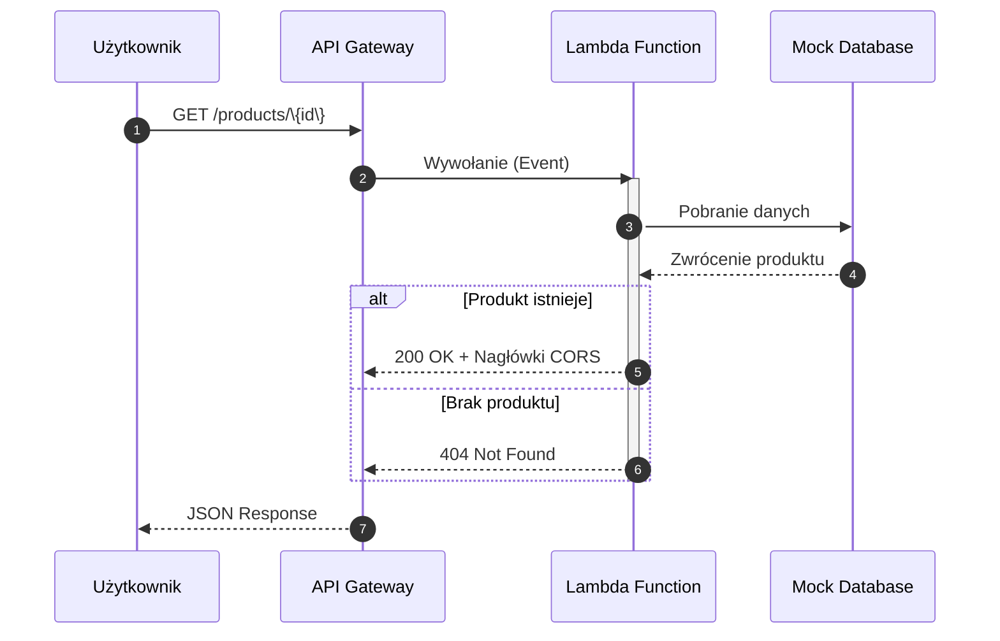

# Przepływ Zapytania API

Diagram sekwencji ilustruje logikę pobierania produktów.

```mermaid
sequenceDiagram
    autonumber
    participant U as Użytkownik
    participant AGW as API Gateway
    participant L as Lambda Function
    participant M as Mock Database

    U->>AGW: GET /products/\{id\}
    AGW->>L: Wywołanie (Event)
    activate L
    L->>M: Pobranie danych
    M-->>L: Zwrócenie produktu
    alt Produkt istnieje
        L-->>AGW: 200 OK + Nagłówki CORS
    else Brak produktu
        L-->>AGW: 404 Not Found
    end
    deactivate L
    AGW-->>U: JSON Response
```