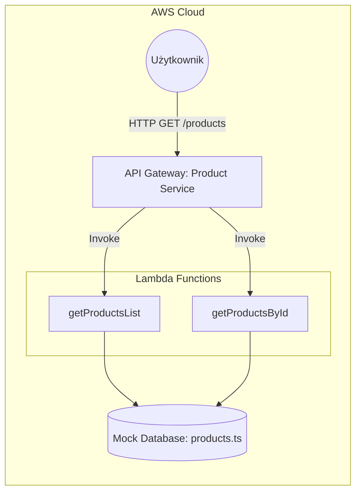

# Architektura Systemu - Task 3

Poniższy schemat przedstawia architekturę bezserwerową (Serverless) zaimplementowaną w ramach zadania.

```mermaid
graph TD
    User((Użytkownik))
    
    subgraph "AWS Cloud"
        direction TB
        
        APIGW[API Gateway: Product Service]
        
        subgraph "Lambda Functions"
            L1[getProductsList]
            L2[getProductsById]
        end
        
        DB[(Mock Database: products.ts)]
        
        User -->|HTTP GET /products| APIGW
        APIGW -->|Invoke| L1
        APIGW -->|Invoke| L2
        L1 --> DB
        L2 --> DB
    end
```