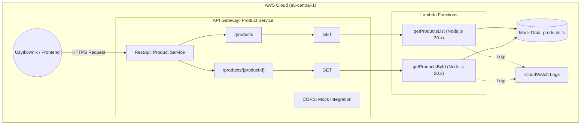

# Szczegółowa Architektura Backend (Task 3)

Diagram przedstawia zasoby zdeployowane w ramach stosu `ProductServiceStack`.

```mermaid
graph TB
    User((Użytkownik / Frontend))

    subgraph "AWS Cloud (eu-central-1)"
        subgraph "API Gateway: Product Service"
            AGW[RestApi: Product Service]
            R1["/products"]
            R2["/products/{productId}"]
            Method1[GET]
            Method2[GET]
            CORS[CORS: Mock Integration]
        end

        subgraph "Lambda Functions"
            L1["getProductsList (Node.js 20.x)"]
            L2["getProductsById (Node.js 20.x)"]
        end

        DB[(Mock Data: products.ts)]
        CW[CloudWatch Logs]

        User -->|HTTPS Request| AGW
        AGW --> R1 --> Method1 --> L1
        AGW --> R2 --> Method2 --> L2
        L1 & L2 --> DB
        L1 & L2 -.->|Logi| CW
    end
```