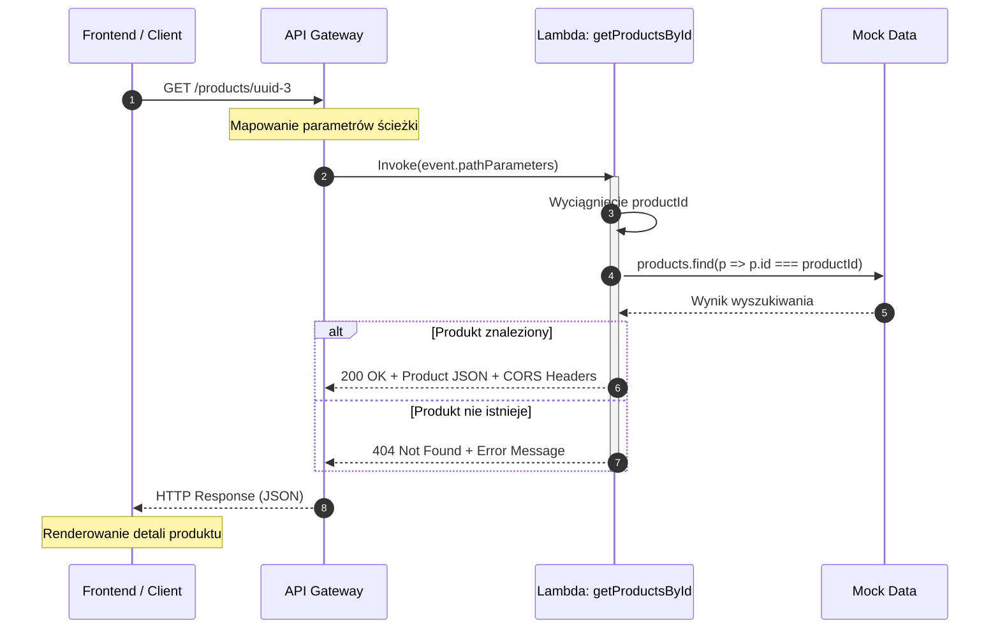

# Szczegółowy Przepływ Logiki API

Diagram sekwencji dla endpointu pobierania produktu po ID.

```mermaid
sequenceDiagram
    autonumber
    participant FE as Frontend / Client
    participant AGW as API Gateway
    participant L2 as Lambda: getProductsById
    participant M as Mock Data

    FE->>AGW: GET /products/uuid-3
    Note over AGW: Mapowanie parametrów ścieżki
    AGW->>L2: Invoke(event.pathParameters)
    activate L2
    L2->>L2: Wyciągnięcie productId
    L2->>M: products.find(p => p.id === productId)
    M-->>L2: Wynik wyszukiwania
    alt Produkt znaleziony
        L2-->>AGW: 200 OK + Product JSON + CORS Headers
    else Produkt nie istnieje
        L2-->>AGW: 404 Not Found + Error Message
    end
    deactivate L2
    AGW-->>FE: HTTP Response (JSON)
    Note over FE: Renderowanie detali produktu
```