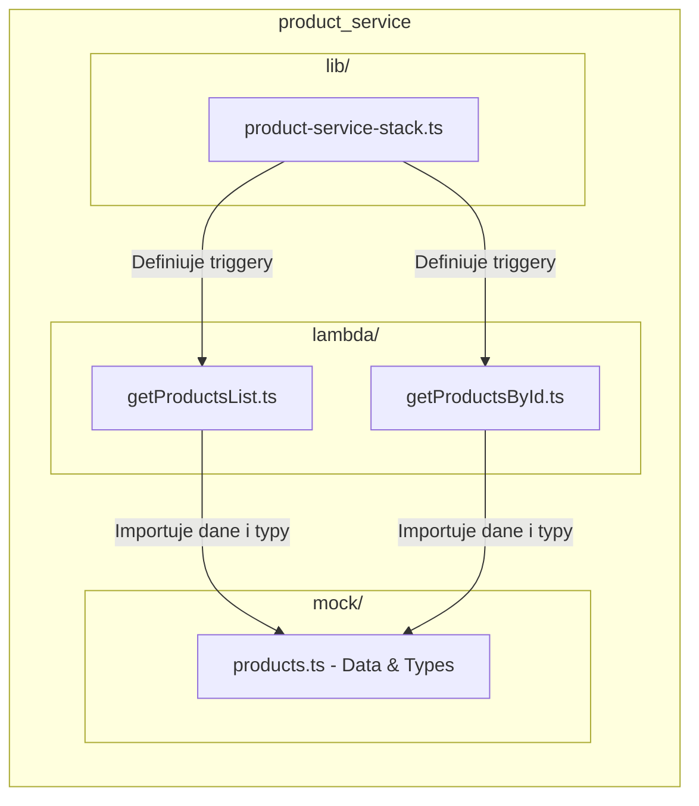

# Separacja Kodu (Codebase Separation)

Zgodnie z wymaganiami dodatkowymi, logika biznesowa, dane oraz infrastruktura zostały odizolowane.

```mermaid
graph LR
    subgraph "product_service"
        subgraph "lambda/"
            L1[getProductsList.ts]
            L2[getProductsById.ts]
        end
        
        subgraph "mock/"
            M[products.ts - Data & Types]
        end
        
        subgraph "lib/"
            S[product-service-stack.ts]
        end
    end

    S -->|Definiuje triggery| L1 & L2
    L1 & L2 -->|Importuje dane i typy| M
```