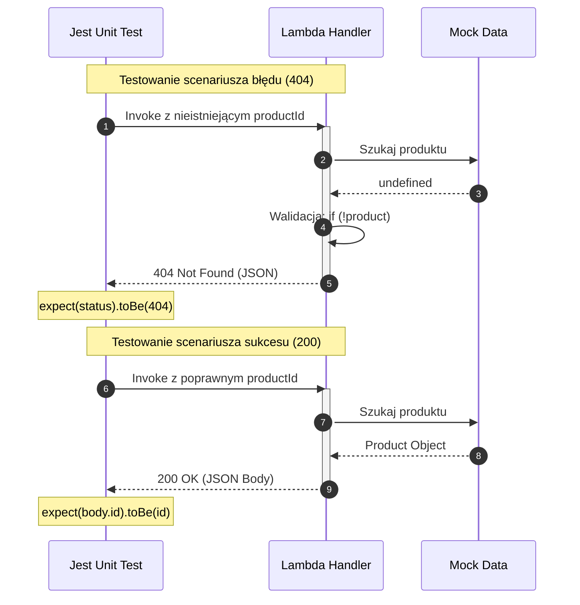

# Obsługa Błędów i Testy Jednostkowe

Diagram przedstawia logikę "Product not found" oraz sposób, w jaki testy jednostkowe weryfikują handlery Lambda.

```mermaid
sequenceDiagram
    autonumber
    participant T as Jest Unit Test
    participant H as Lambda Handler
    participant M as Mock Data

    Note over T, H: Testowanie scenariusza błędu (404)
    T->>H: Invoke z nieistniejącym productId
    activate H
    H->>M: Szukaj produktu
    M-->>H: undefined
    H->>H: Walidacja: if (!product)
    H-->>T: 404 Not Found (JSON)
    deactivate H
    Note over T: expect(status).toBe(404)

    Note over T, H: Testowanie scenariusza sukcesu (200)
    T->>H: Invoke z poprawnym productId
    activate H
    H->>M: Szukaj produktu
    M-->>H: Product Object
    H-->>T: 200 OK (JSON Body)
    deactivate H
    Note over T: expect(body.id).toBe(id)
```