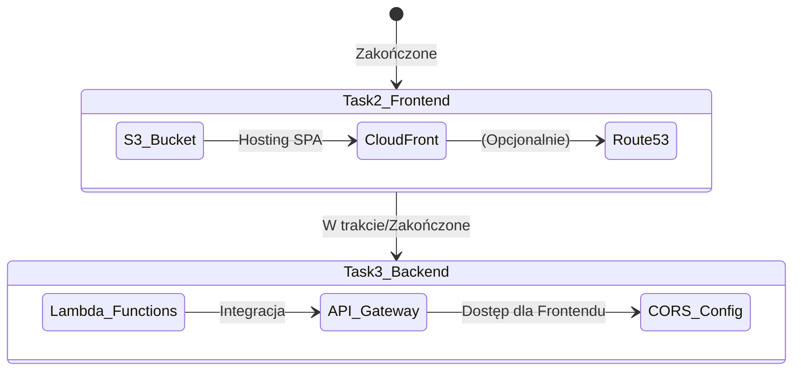

# Postęp Projektu - Status Zadań

## Status Implementacji


## Architektura Połączona
```mermaid
graph LR
    User((Użytkownik)) -->|Przegląda sklep| CF[CloudFront SPA]
    CF -->|Pobiera statyczne pliki| S3[S3 Bucket]
    
    User -->|Wywołuje API| AGW[API Gateway: Product Service]
    AGW -->|GET /products| L1[Lambda: getProductsList]
    AGW -->|GET /products/\{id\}| L2[Lambda: getProductsById]
```