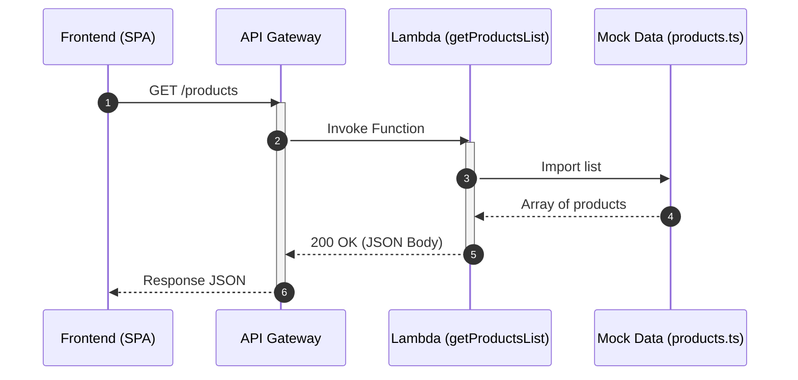

# Flow pobierania produktów (Sequence Diagram)

Poniższy diagram ilustruje interakcję między frontendem a backendem podczas żądania listy produktów.

```mermaid
sequenceDiagram
    autonumber
    participant Client as Frontend (SPA)
    participant APIGW as API Gateway
    participant Lambda as Lambda (getProductsList)
    participant Mock as Mock Data (products.ts)

    Client->>APIGW: GET /products
    activate APIGW
    APIGW->>Lambda: Invoke Function
    activate Lambda
    Lambda->>Mock: Import list
    Mock-->>Lambda: Array of products
    Lambda-->>APIGW: 200 OK (JSON Body)
    deactivate Lambda
    APIGW-->>Client: Response JSON
    deactivate APIGW
```