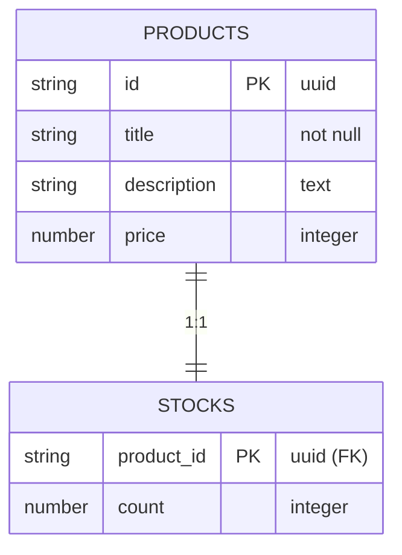

# Konfiguracja Bazy Danych DynamoDB

Zgodnie z wymaganiem Task 4.1, tabele zostały utworzone w AWS Console.

## Model Danych (ERD)

## Szczegóły Tabel

- **products**:
    - Partition Key: `id` (S)
    - Billing Mode: PAY_PER_REQUEST
- **stocks**:
    - Partition Key: `product_id` (S)
    - Billing Mode: PAY_PER_REQUEST