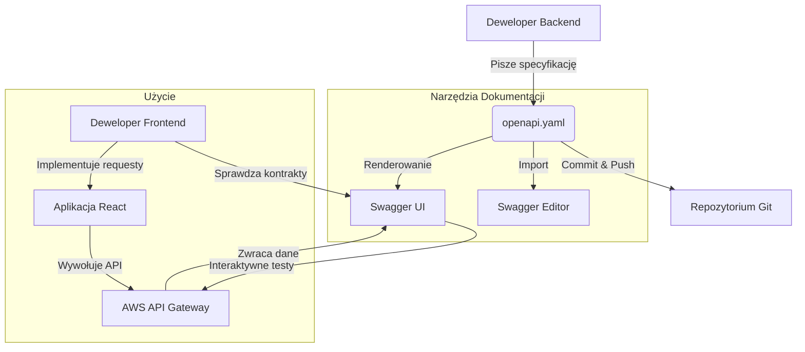

# Wykorzystanie dokumentacji OpenAPI/Swagger

Poniższy diagram przedstawia przepływ pracy z dokumentacją API w projekcie.

Dokumentacja pozwala na pracę w modelu **API-First**, gdzie struktura danych jest znana przed implementacją frontendu.