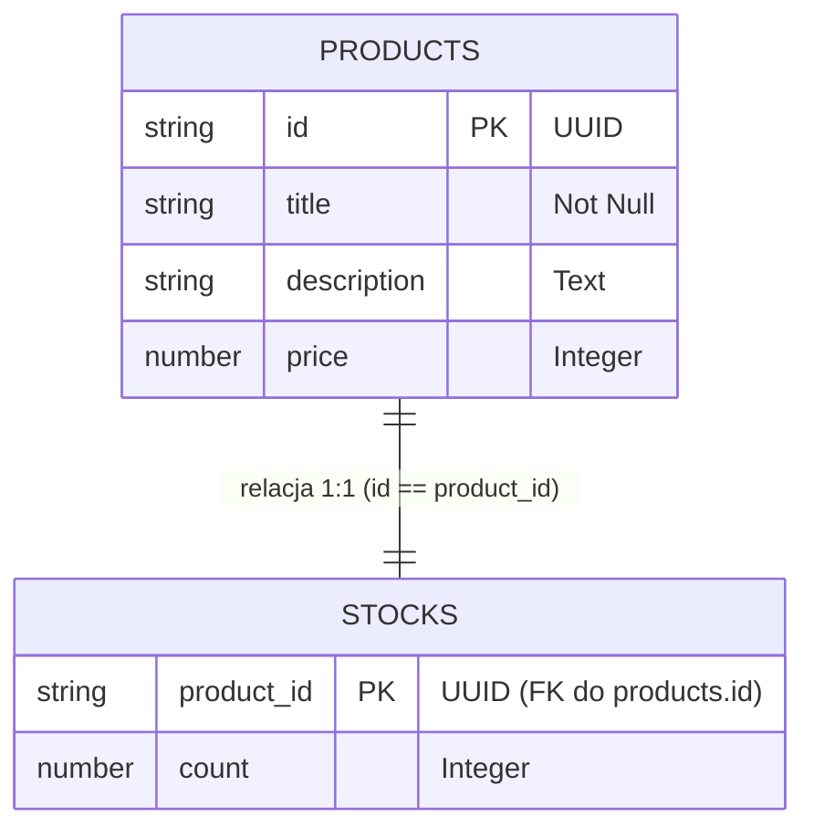

# Architektura Bazy Danych (Etap 1)

Zgodnie z wymaganiem Task 4.1, wykorzystujemy dwie tabele w modelu relacyjnym 1:1. Tabele zostały utworzone manualnie w AWS Console.

## Diagram ERD (Entity Relationship Diagram)

## Szczegóły Tabel

### Tabela: `products`
- **Partition Key**: `id` (String)
- **Atrybuty**: `title` (S), `description` (S), `price` (N)
- **Capacity Mode**: On-Demand (PAY_PER_REQUEST)

### Tabela: `stocks`
- **Partition Key**: `product_id` (String)
- **Atrybuty**: `count` (N)
- **Capacity Mode**: On-Demand (PAY_PER_REQUEST)

## Integracja
W kolejnych etapach tabele zostaną podłączone do serwisu produktów (CDK) i obsłużone przez Lambdy GET oraz POST.