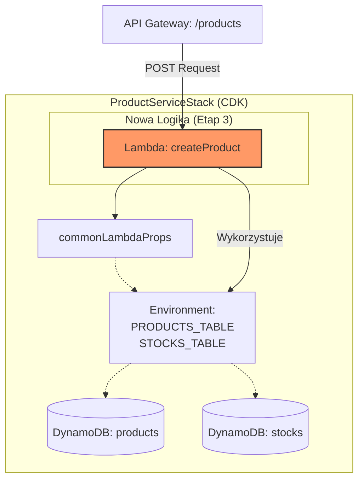
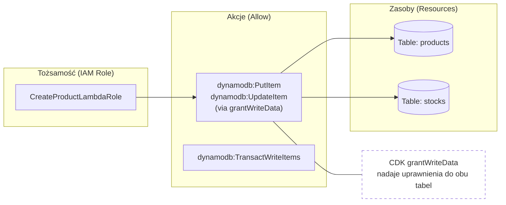

# Dokumentacja Zmian w Stosie CDK - Etap 3 (createProduct)

Ten dokument szczegółowo opisuje modyfikacje wprowadzone w stosie AWS CDK (`ProductServiceStack`) w celu zaimplementowania funkcji `createProduct` oraz obsługi transakcyjnego zapisu danych do DynamoDB.

## 1. Diagram Zasobów Stosu (Rozszerzenie Infrastruktury)

Ten diagram przedstawia, jak nowa funkcja Lambda `createProduct` została zintegrowana z istniejącą architekturą, wykorzystując wspólne właściwości (`commonLambdaProps`) i wchodząc w interakcje z tabelami DynamoDB.



## 2. Diagram Uprawnień IAM (Zasada najniższych uprawnień)

Operacja `TransactWriteItems` w DynamoDB wymaga specyficznych uprawnień do zapisu w wielu tabelach. Poniższy diagram ilustruje, jakie uprawnienia zostały nadane roli IAM funkcji `createProduct` za pomocą metody `grantWriteData` w CDK.



## 3. Diagram Drzewa API Gateway

Ten diagram przedstawia modyfikację definicji endpointów w API Gateway. Do istniejącego zasobu `/products` została dodana nowa metoda `POST`, która kieruje ruch do funkcji Lambda `createProduct`.

```mermaid
graph TD
    Root[/] --> Products[/"products (Resource)"/]
    
    subgraph "Istniejące Metody"
        Products --> GET_List["GET: getProductsList"]
    end
    
    subgraph "ZMIANA: Nowa Metoda"
        Products --> POST["POST: createProduct"]
        style POST fill:#f96,stroke:#333,stroke-width:2px
    end
    
    subgraph "Szczegóły Produktu"
        Products --> ID[/"{productId}"/]
        ID --> GET_ID["GET: getProductsById"]
    end
```

## Opis Konkretnych Modyfikacji w Kodzie `ProductServiceStack.ts`:

Aby zaimplementować powyższe zmiany, w pliku stosu CDK (`lib/product-service-stack.ts`) należy wprowadzić następujące modyfikacje:

1.  **Inicjalizacja funkcji `NodejsFunction` dla `createProduct`**:
    *   Wykorzystanie `commonLambdaProps` w celu zapewnienia spójnej konfiguracji (np. zmienne środowiskowe `PRODUCTS_TABLE` i `STOCKS_TABLE`).
    *   Ustawienie `entry` na ścieżkę do pliku handlera `e:\product-service\handlers\createProduct.ts`.

2.  **Zarządzanie dostępem (IAM)**:
    *   Wywołanie `productsTable.grantWriteData(createProduct)` w celu nadania uprawnień do zapisu w tabeli `products`.
    *   Wywołanie `stocksTable.grantWriteData(createProduct)` w celu nadania uprawnień do zapisu w tabeli `stocks`. Jest to kluczowe dla poprawnego działania `TransactWriteCommand`.

3.  **Mapowanie API Gateway**:
    *   Pobranie referencji do istniejącego zasobu `/products`.
    *   Dodanie metody `POST` do tego zasobu, integrując ją z nową funkcją Lambda `createProduct` za pomocą `apigateway.LambdaIntegration`.