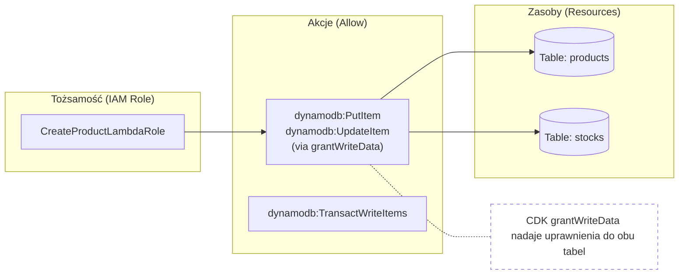
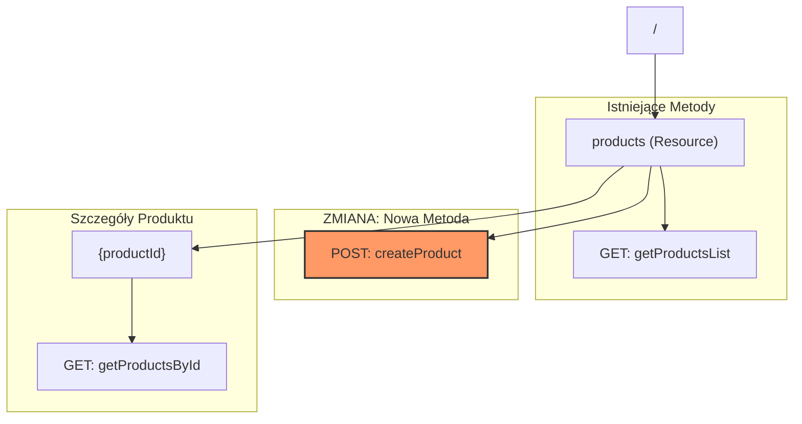

# Poprawione Diagramy CDK - Etap 3

Poniżej znajdują się poprawione wersje diagramów Mermaid dla Etapu 3, w których wyeliminowano błędy parsowania.

## 1. Diagram Uprawnień IAM (Poprawiony)

Zastąpiono składnię `Note over` (zarezerwowaną dla diagramów sekwencji) węzłem połączonym linią przerywaną, co jest poprawne dla typu `graph LR`.

## 2. Diagram Drzewa API Gateway (Poprawiony)

Naprawiono błąd `Lexical error` poprzez użycie cudzysłowów dla węzłów zawierających znaki specjalne (jak `/` czy `{}`) zamiast błędnej składni kształtów.

