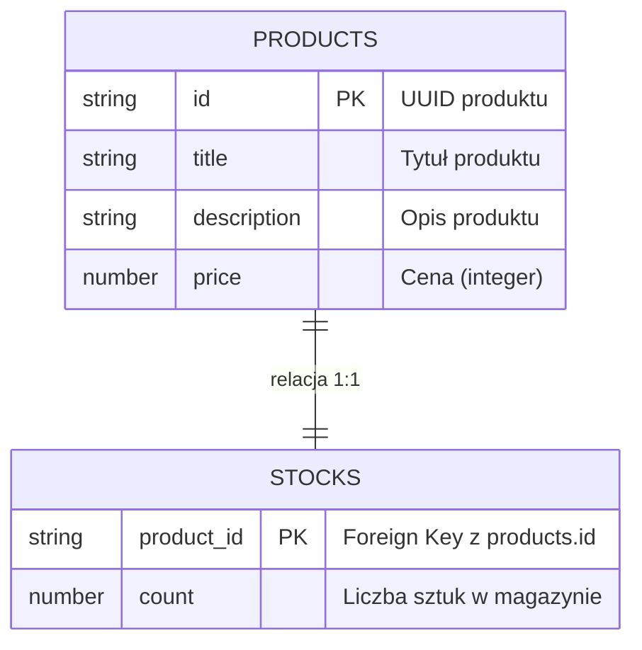

# Dokumentacja Etapu 1 - Integracja z DynamoDB

W ramach pierwszego etapu skonfigurowano bazę danych NoSQL oraz przygotowano skrypty zasilające.

## Model Danych (ERD)

Dane są przechowywane w dwóch oddzielnych tabelach DynamoDB, połączonych relacją 1:1 za pomocą `id` produktu.

## Decyzje projektowe

1.  **Tabele**: Utworzono tabele `products` oraz `stocks`.
2.  **Klucze**:
    *   `products`: Partition Key = `id` (String).
    *   `stocks`: Partition Key = `product_id` (String).
3.  **Tryb wydajności**: `PAY_PER_REQUEST` (On-Demand), aby zminimalizować koszty przy małym ruchu.

## Proces zasilania (Seeding)

Do zasilenia bazy danych wykorzystano skrypt `product_service/scripts/seed-dynamodb.ts`, który:
1. Generuje unikalne ID dla produktów.
2. Wstawia dane atomowo do tabeli produktów.
3. Wstawia powiązany stan magazynowy do tabeli stocks.