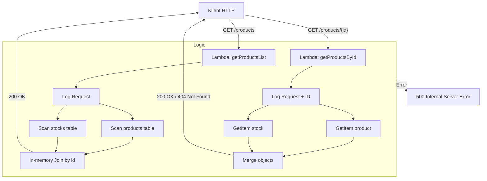
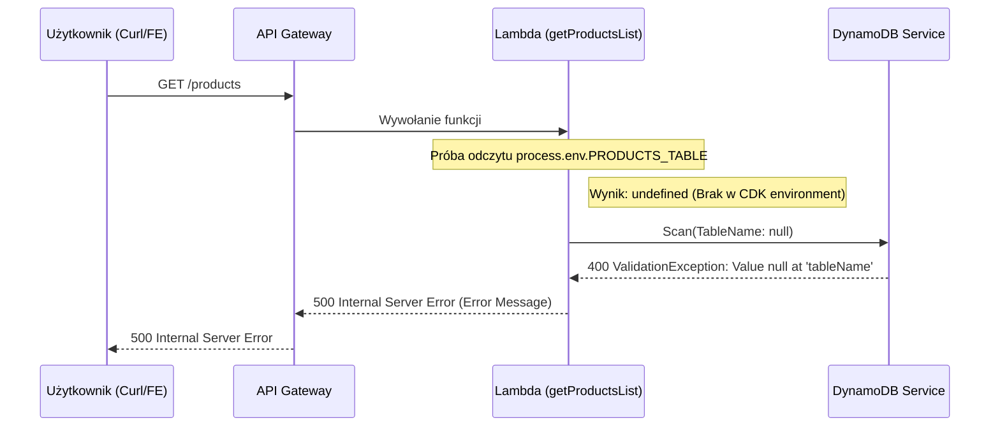
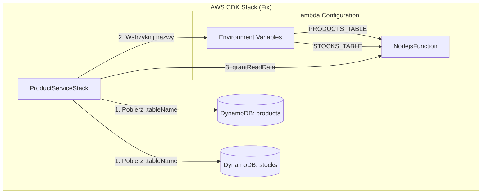

# Dokumentacja Etapu 2 - Odczyt Danych (GET)

Zgodnie z wymaganiem **Task 4.2**, dane z tabel `products` i `stocks` są łączone na poziomie backendu.

## Diagram przepływu danych (Mermaid)

## Szczegóły implementacji
- **Join**: DynamoDB nie wspiera joinów, więc pobieramy dane z obu tabel i łączymy je w obiekcie odpowiedzi.
- **Logging**: Każdy request loguje cały `event` do CloudWatch.
- **Error Handling**: Cały kod jest w bloku try-catch, zwracając status 500 przy błędach bazy lub kodu.

## Troubleshooting: Fix Etapu 2 (ValidationException)

Podczas implementacji wystąpił błąd `500 Internal Server Error` z komunikatem `ValidationException: Value null at 'tableName'`.

### Przyczyna błędu (Diagram Sekwencji)
Błąd wynikał z faktu, że SDK DynamoDB otrzymało wartość `null` zamiast nazwy tabeli, ponieważ zmienne środowiskowe nie zostały poprawnie wstrzyknięte przez CDK.

### Rozwiązanie (Diagram Infrastruktury)
Poprawka polegała na jawnym przekazaniu nazw tabel z zasobów CDK do sekcji `environment` funkcji Lambda oraz nadaniu uprawnień IAM (`grantReadData`).

