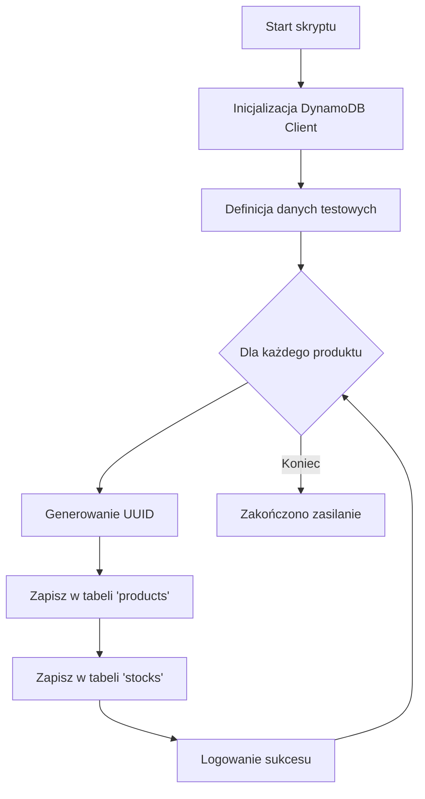
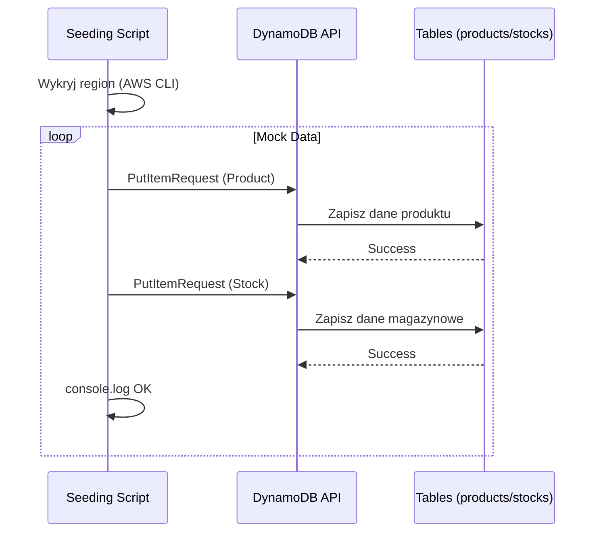

# Struktura skryptu zasilającego

Dokumentacja działania skryptu `seed-dynamodb.ts`.

## Logika działania (Flowchart)

```mermaid
graph TD
    Start[Start skryptu] --> Config[Inicjalizacja DynamoDB Client]
    Config --> Data[Definicja danych testowych]
    Data --> Loop{Dla każdego produktu}
    Loop --> UUID[Generowanie UUID]
    UUID --> PutProd[Zapisz w tabeli 'products']
    PutProd --> PutStock[Zapisz w tabeli 'stocks']
    PutStock --> Log[Logowanie sukcesu]
    Log --> Loop
    Loop -- Koniec --> End[Zakończono zasilanie]
```

## Diagram sekwencji

```mermaid
sequenceDiagram
    participant Script as Seeding Script
    participant AWS as DynamoDB API
    participant DB as Tables (products/stocks)

    Script->>Script: Wykryj region (AWS CLI)
    loop Mock Data
        Script->>AWS: PutItemRequest (Product)
        AWS->>DB: Zapisz dane produktu
        DB-->>AWS: Success
        
        Script->>AWS: PutItemRequest (Stock)
        AWS->>DB: Zapisz dane magazynowe
        DB-->>AWS: Success
        
        Script->>Script: console.log OK
    end
```