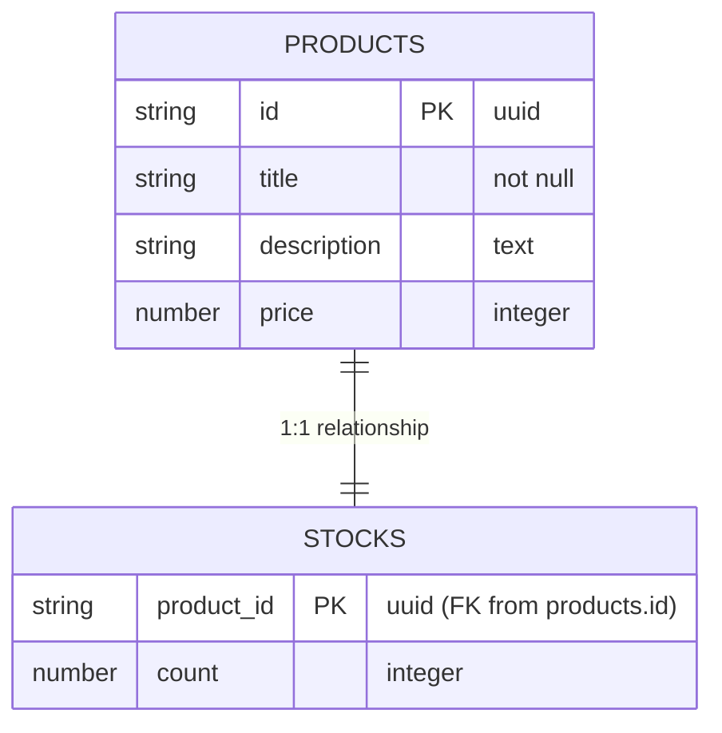

# Setup Baz Danych DynamoDB (Task 4.1)

Zgodnie z instrukcją, tabele bazy danych zostały utworzone ręcznie za pomocą konsoli AWS.

## Schemat Tabel

## Szczegóły konfiguracji

1.  **Tabela `products`**:
    *   Partition Key: `id` (String)
    *   Capacity Mode: On-Demand

2.  **Tabela `stocks`**:
    *   Partition Key: `product_id` (String)
    *   Capacity Mode: On-Demand

Nazwy tabel zostały przekazane do usług Lambda poprzez zmienne środowiskowe w stosie CDK.