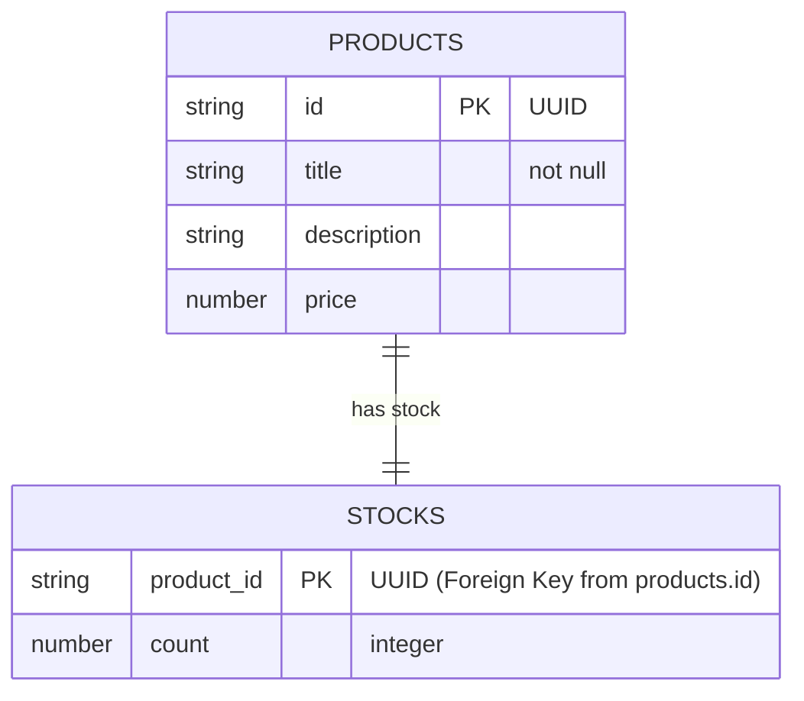

# Dokumentacja Etapu 1 - Integracja z NoSQL (DynamoDB)

Zgodnie z wymaganiem **Task 4.1**, tabele bazy danych zostały utworzone ręcznie za pomocą AWS Console w regionie docelowym.

## Schemat Bazy Danych (ERD)

Poniższy diagram przedstawia relację 1:1 między tabelami `products` i `stocks`.

## Szczegóły Konfiguracji

1. **Tabela `products`**:
   - **Partition Key**: `id` (String)
   - **Tryb**: On-Demand (Pay per request)
2. **Tabela `stocks`**:
   - **Partition Key**: `product_id` (String)
   - **Tryb**: On-Demand (Pay per request)