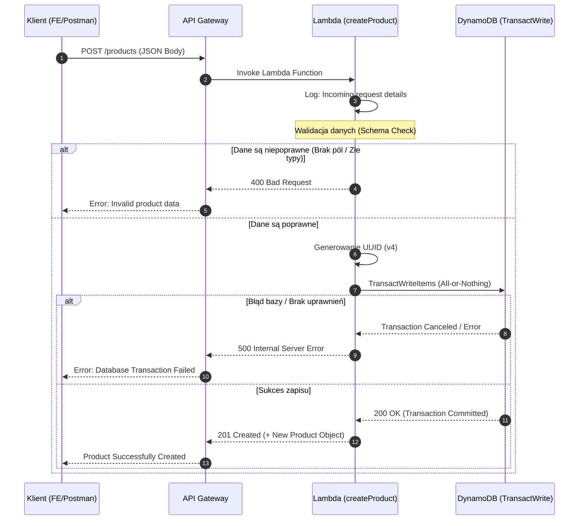
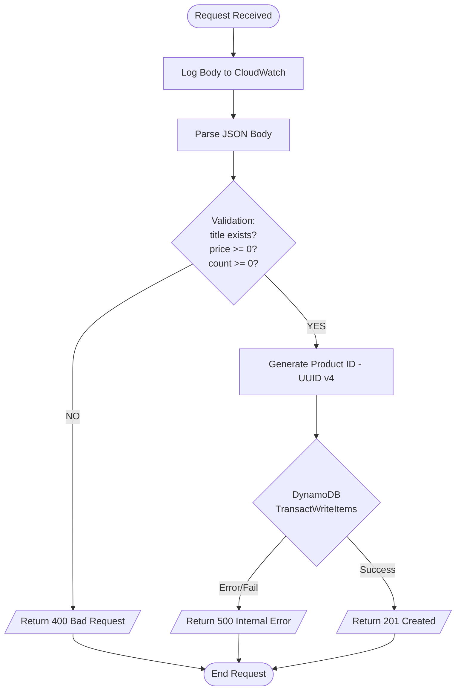

# Dokumentacja Etapu 3 - Zapis i Transakcje (POST)

Zaimplementowano tworzenie produktów z wykorzystaniem transakcji ACID w DynamoDB.

## Funkcjonalności
1. **POST /products**: Punkt końcowy przyjmujący dane produktu i stanu magazynowego.
2. **Atomowość (Transactions)**: Wykorzystanie `TransactWriteItems`. Produkt i jego stan magazynowy są tworzone jednocześnie. Jeśli jeden zapis zawiedzie, cała operacja jest wycofywana.
3. **Walidacja**: System sprawdza obecność i typy pól `title`, `price` oraz `count`.

## Architektura i Przepływ Danych

### 1. Diagram Sekwencji (Interakcja Systemowa)
Opisuje komunikację od żądania klienta po odpowiedź końcową.

### 2. Diagram Logiki Wewnętrznej (Logic Flow)
Szczegółowy opis decyzji podejmowanych wewnątrz handlera.

## Bonusy: Zrealizowano walidację (400), obsługę błędów (500), logowanie żądań oraz transakcyjność.