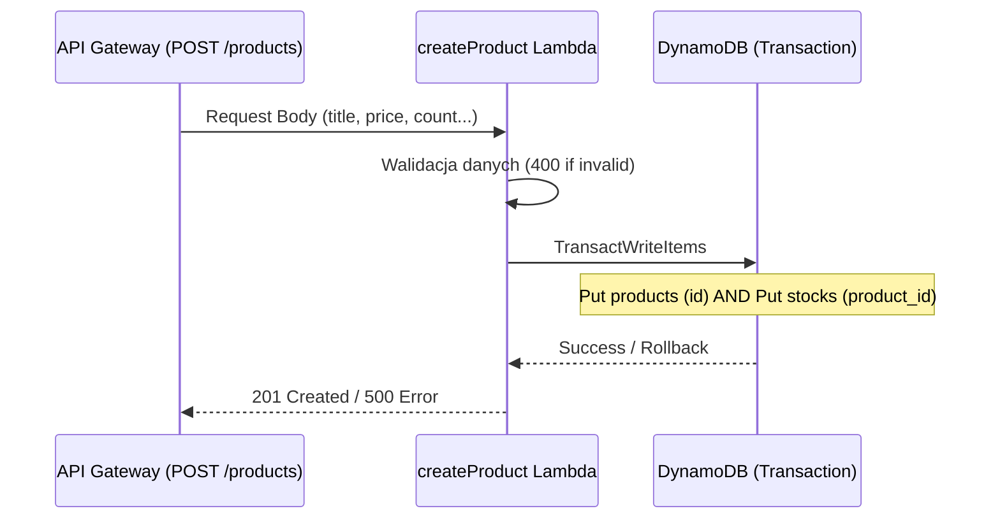

# Transakcyjny Zapis Produktów (Etap 3)

Zgodnie z wymaganiem dodatkowym (+7.5), proces tworzenia produktu jest operacją atomową.

## Diagram sekwencji (Transaction Flow)

## Szczegóły implementacji
- **Walidacja (Status 400)**: Sprawdzamy czy wymagane pola (title, price, count) istnieją i mają poprawne typy.
- **Atomowość**: Używamy `TransactWriteItems`. Jeśli zapis do tabeli `stocks` zawiedzie, rekord w tabeli `products` nie zostanie utworzony.
- **Generowanie ID**: Lambda generuje unikalny `id` (UUID), który służy jako klucz w obu tabelach.
- **Logger**: Każdy przychodzący body jest logowany w CloudWatch.