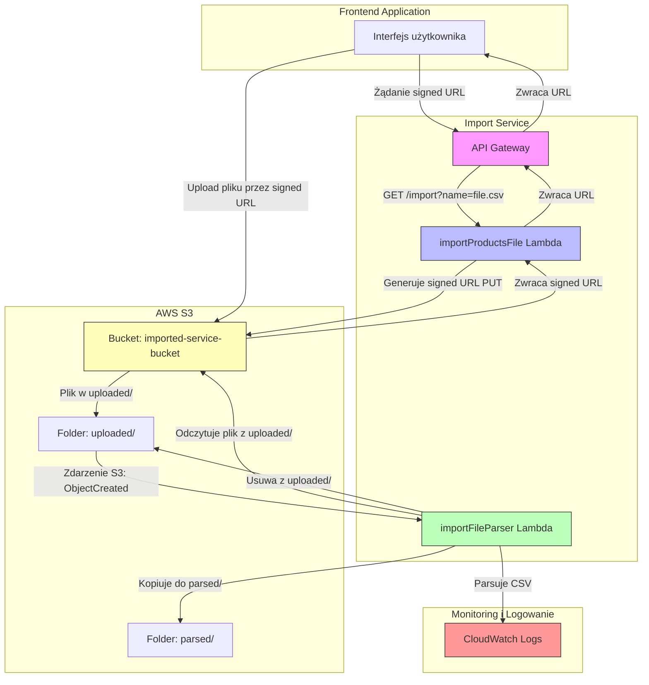
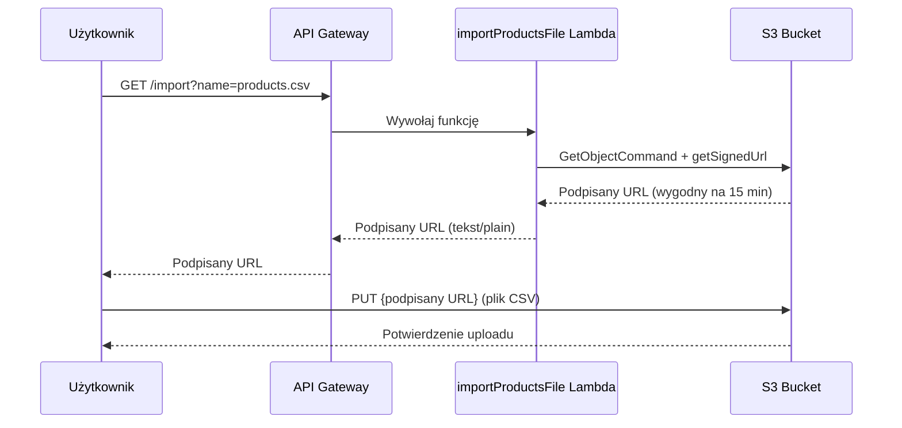
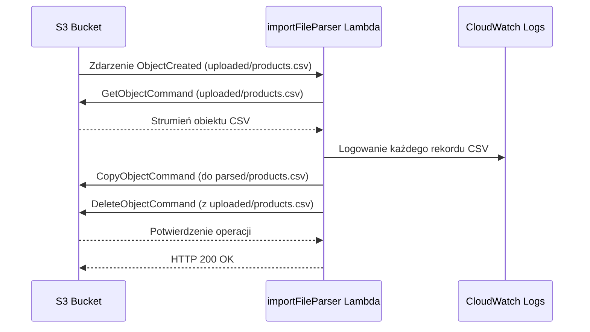
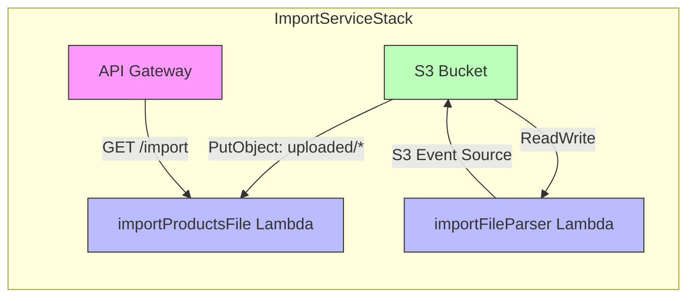

# Task 5 Progress Documentation

## Etap 1: Struktura projektu i konfiguracja (ukończono)

### Utworzono strukturę katalogów:
- import-service/
  - bin/ - punkt wejścia CDK
  - lib/ - stos CDK
  - lambda/ - funkcje Lambda
    - importProductsFile/ - funkcja generująca podpisane URL
    - importFileParser/ - funkcja przetwarzająca pliki CSV
  - test/ - katalog na testy
  - package.json - zależności
  - tsconfig.json - konfiguracja TypeScript
  - jest.config.js - konfiguracja testów
  - cdk.json - konfiguracja CDK

### Utworzono pliki konfiguracyjne:
1. **package.json** - zawiera zależności:
   - @aws-sdk/client-s3 (do operacji na S3)
   - aws-cdk-lib, constructs (infrastruktura jako kod)
   - csv-parser (do przetwarzania CSV)
   - source-map-support, uuid (wsparcie)
   - DevDependencies: @types/*, aws-cdk, aws-sdk-client-mock, esbuild, jest, ts-jest, typescript

2. **tsconfig.json** - konfiguracja TypeScript zgodna z product-service:
   - target: ES2022
   - module: commonjs
   - strict mode włączony
   - include: lambda, test, lib, bin

3. **jest.config.js** - konfiguracja testów:
   - preset: ts-jest
   - testEnvironment: node
   - testMatch: **/test/**/*.test.ts

4. **cdk.json** - konfiguracja aplikacji CDK:
   - app: npx ts-node bin/import-service.ts

### Utworzono stos CDK (ImportServiceStack):
- Tworzy kosz S3 z wersjonowaniem i szyfrowaniem
- Definiuje dwie funkcje Lambda:
  - importProductsFile: generuje podpisane URL do uploadu
  - importFileParser: przetwarza pliki CSV z kosza S3
- Przyznaje odpowiednie uprawnienia:
  - importProductsFile: s3:PutObject dla uploaded/*
  - importFileParser: s3:GetObject, s3:PutObject, s3:DeleteObject dla całego kosza
- Konfiguruje API Gateway z endpointem GET /import
- Dodaje trigger S3 dla funkcji importFileParser (zdarzenia OBJECT_CREATED w folderze uploaded/)
- Wyprowadza nazwę kosza, URL API i URL funkcji importProductsFile

### Diagramy architektury (Mermaid)

#### 1. Całkowita architektura usługi importowej


#### 2. Przepływ danych dla importProductsFile (generowanie signed URL)


#### 3. Przepływ danych dla importFileParser (przetwarzanie CSV)


#### 4. Diagram komponentów CDK

```

### Utworzono funkcje Lambda:

#### importProductsFile/handler.ts:
- Endpoint HTTP GET oczekujący parametru query `name` (nazwa pliku CSV)
- Waliduje obecność parametru `name`
- Używa @aws-sdk/client-s3 do generowania podpisanego URL PUT
- Klucz w formacie: `uploaded/${fileName}`
- URL podpisany ważny przez 15 minut (900 sekund)
- Zwraca czysty tekst (nie JSON) z nagłowkiem Content-Type: text/plain
- Obsługuje błędy zwracając odpowiednie kody statusu

#### importFileParser/handler.ts:
- Funkcja wyzwalana przez zdarzenia S3 ObjectCreated
- Przetwarza każdy rekord w zdarzeniu (S3 może grupować wiele rekordów)
- Dla każdego pliku:
  1. Pobiera obiekt z S3 jako strumień odczytywany
  2. Używa csv-parser do przetworzenia CSV z nagłówkami kolumn
  3. Loguje każdy rekord do CloudWatch
  4. (Opcjonalnie) przenosi plik do folderu parsed/ i usuwa z uploaded/
     - Kopiuje obiekt do parsed/[nazwa_pliku]
     - Usuwa oryginalny obiekt z uploaded/
- Obsługuje błędy z odpowiednim logowaniem

## Następne kroki:
1. Zainstalować zależności (npm install w katalogu import-service)
2. Zbudować projekt (npm run build)
3. Wdrożyć stos CDK (npm run cdk deploy)
4. Przetestować endpointy
5. Napisać testy jednostkowe

## Uwagi dotyczące bezpieczeństwa:
- Kosz S3 ma blokowany dostęp publiczny
- Wdrożono zasadę minimalnych uprawnień dla funkcji Lambda
- Usunięto komentarze zawierające dane uwierzytelniające
- W kodzie nie przechowuje się żadnych danych uwierzytelniających

## Gotowe do kontynuacji:
Po zapisaniu tej dokumentacji, możemy przejść do instalacji zależności i budowania projektu.