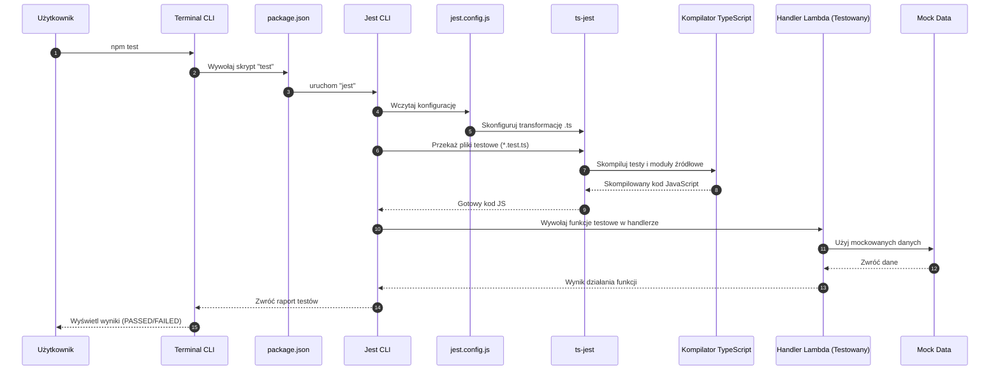

# Przepływ uruchamiania testów jednostkowych

Diagram przedstawia kroki wykonywane podczas uruchamiania testów jednostkowych w projekcie.

```mermaid
sequenceDiagram
    autonumber
    participant User as Użytkownik
    participant Terminal as Terminal CLI
    participant PackageJson as package.json
    participant JestCLI as Jest CLI
    participant JestConfig as jest.config.js
    participant TsJest as ts-jest
    participant TypeScript as Kompilator TypeScript
    participant Handler as Handler Lambda (Testowany)
    participant MockData as Mock Data

    User->>Terminal: npm test
    Terminal->>PackageJson: Wywołaj skrypt "test"
    PackageJson->>JestCLI: uruchom "jest"
    JestCLI->>JestConfig: Wczytaj konfigurację
    JestConfig->>TsJest: Skonfiguruj transformację .ts
    JestCLI->>TsJest: Przekaż pliki testowe (*.test.ts)
    TsJest->>TypeScript: Skompiluj testy i moduły źródłowe
    TypeScript-->>TsJest: Skompilowany kod JavaScript
    TsJest-->>JestCLI: Gotowy kod JS
    JestCLI->>Handler: Wywołaj funkcje testowe w handlerze
    Handler->>MockData: Użyj mockowanych danych
    MockData-->>Handler: Zwróć dane
    Handler-->>JestCLI: Wynik działania funkcji
    JestCLI-->>Terminal: Zwróć raport testów
    Terminal-->>User: Wyświetl wyniki (PASSED/FAILED)
```